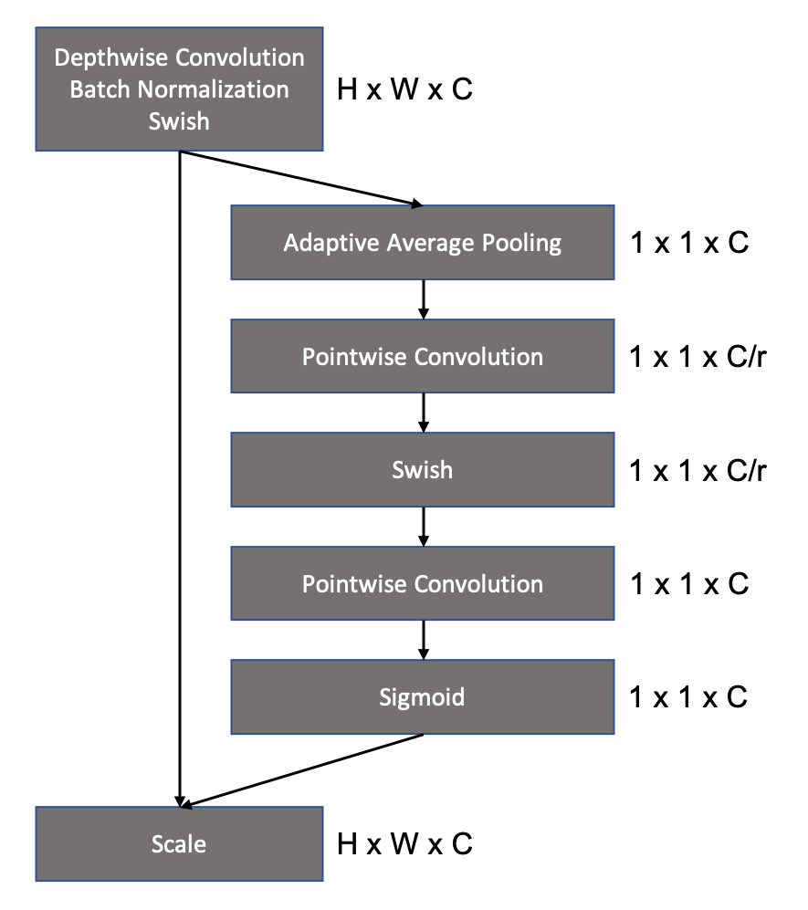

# EfficientNet - Pytorch

Original Paper: https://arxiv.org/pdf/1905.11946.pdf

**Work in Progress**

This is my personal implementation of EfficientNet with Pytorch. I start by implementing the baseline B0 network and go from there. Maybe I also try to build EfficientNetV2 in the long term. To train my own baseline model, I use the ImageNet subset from Kaggle (https://www.kaggle.com/c/imagenet-object-localization-challenge/overview/description).

# Basic Building Blocks

Besides the scaling strategy based on the compound scaling coefficient and neural architecture search (NAS), EfficientNet consists of a few basic building blocks which originate from older papers like MobileNetV2. 

## Mobile Inverted Bottleneck

Original Paper: https://arxiv.org/pdf/1801.04381.pdf 

The Mobile Inverted Bottleneck is nothing fancy but an Inverted Residual Block used in MobileNetV2 with a squeeze and excite block injected sometimes (not part of the visualization here). In contrast to ReLU6, the Swish activation function (Pytorch -> nn.SiLU) is used in EfficientNet.

## Squeeze and Excitation Blocks 

Original Paper: https://arxiv.org/pdf/1709.01507.pdf

## Architecture 

The table down below shows the overall architecture of the EfficientNet-B0 baseline network which was obtained by doing a Neural Architecture Search (NAS) that optimizes for both accuracy and FLOPS.

From this baseline you can construct all the bigger models based on the scaling (width and depth coefficients + resolution).

# TODOs

* custom learning rate scheduler with warmup 
* Multi-GPU & mixed precision training
* inference demo notebook, look at some examples
* some explanation, how does this thing work and what makes it so efficient